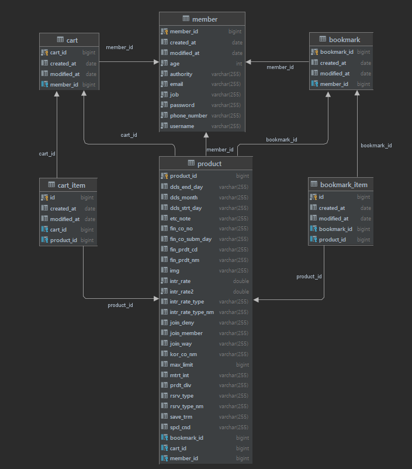

# 금융상품 추천 서비스

## ⚙ 프로젝트 개발 환경
- 통합개발환경 : Intellij
- JDK 버전 : JDK 11
- 스프링부트 버전 : 2.7.3
- 사용 DB : MySQL, **Redis**
- 빌드툴 : Gradle
- 관리툴 : Git, Github, Docker, AWS EC2, ELB

## ⚒ 백엔드 기술 스택
- Backend
    - Spring Boot
    - Spring Security
    - Spring Validation
    - Spring Data Jpa
    - Spring Devtools
    - Springfox (swagger)
    - Gson
    - Lombok
    - JWT

- Database
    - MySQL 8.0.28
    - Redis 6.2.6

## 📜 프로젝트 구현 기능
- 회원 (Member)
  - 회원가입, 로그인 및 로그아웃
- 상품 (Product)
  - 금융권API를 이용한 예적금 상품 자동 등록, 예적금 상품 상세조회, 예금상품 검색, 적금상품 검색
- 관심 상품 (Bookmark)
  - 관심상품 등록, 관심상품 목록 조회, 관심상품 삭제
- 장바구니 (Cart)
  - 장바구니 등록, 장바구니 목록 조회, 장바구니 삭제

## 📂 프로젝트 DB 모델링

> member : 회원 정보 테이블  
> product : 여행상품 정보 테이블  
> cart : 회원 장바구니 테이블  
> cart_item : 회원 장바구니 목록 테이블  
> bookmark : 회원 즐겨찾기 테이블  
> bookmark_item : 회원 즐겨찾기 목록 테이블  

## 📜 프로젝트 API 명세서

|Function|Method|End Point|Token|
|---|---|---|:---:|
|회원가입|POST|/auth/signup|X|
|로그인|POST|/auth/login|X|
|회원정보 조회|GET|/member/{id}|O|
|내정보 조회|GET|/member/me|O|
|전체 예적금 상품 조회|GET|/products|X|
|전체 예적금 상품 검색|GET|/products/{korCoNm}|X|
|전체 예금상품 조회|GET|/products/deposit|X|
|전체 적금상품 조회|GET|/products/saving|X|
|예적금 상품 상세조회|GET|/product/{id}|X|
|장바구니 담기|POST|/cart/{productId}|O|
|장바구니 단일 삭제|DELETE|/cart/{productId}|O|
|장바구니 전체목록 보기|GET|/carts|O|
|장바구니 전체목록 삭제|DELETE|/carts|O|
|즐겨찾기 담기|POST|/bookmark/{productId}|O|
|즐겨찾기 단일 삭제|DELETE|/bookmark/{productId}|O|
|즐겨찾기 전체목록 보기|GET|/bookmarks|O|
|즐겨찾기 전체목록 삭제|DELETE|/bookmarks|O|
